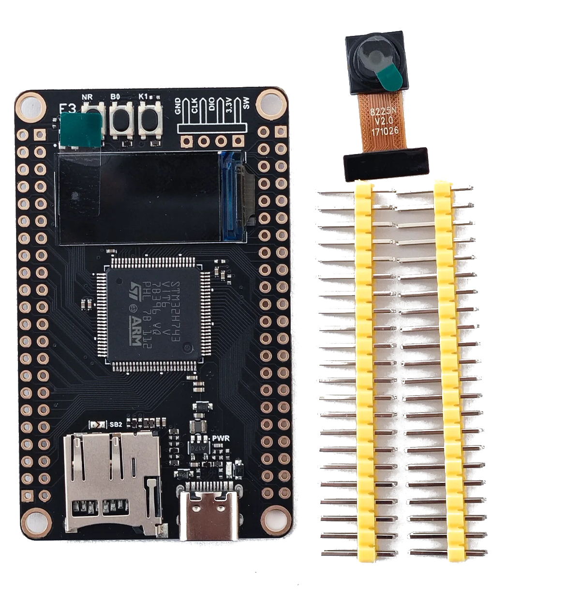
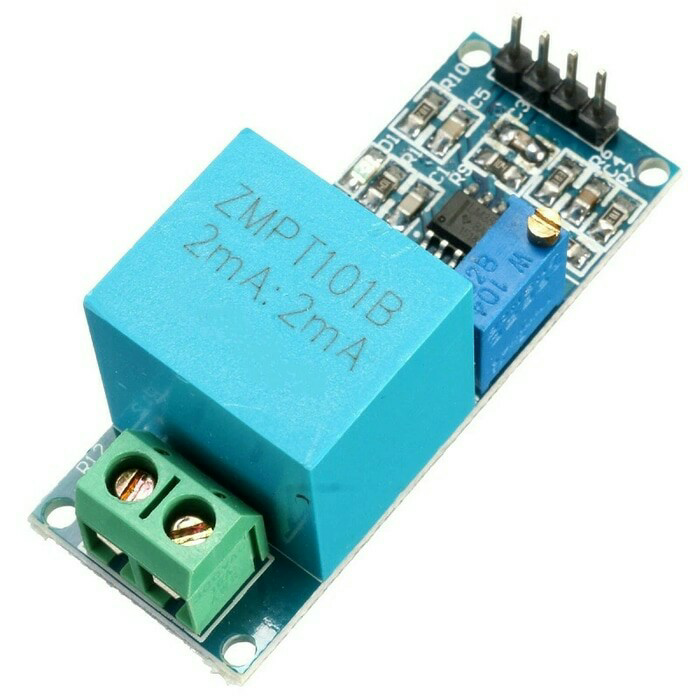
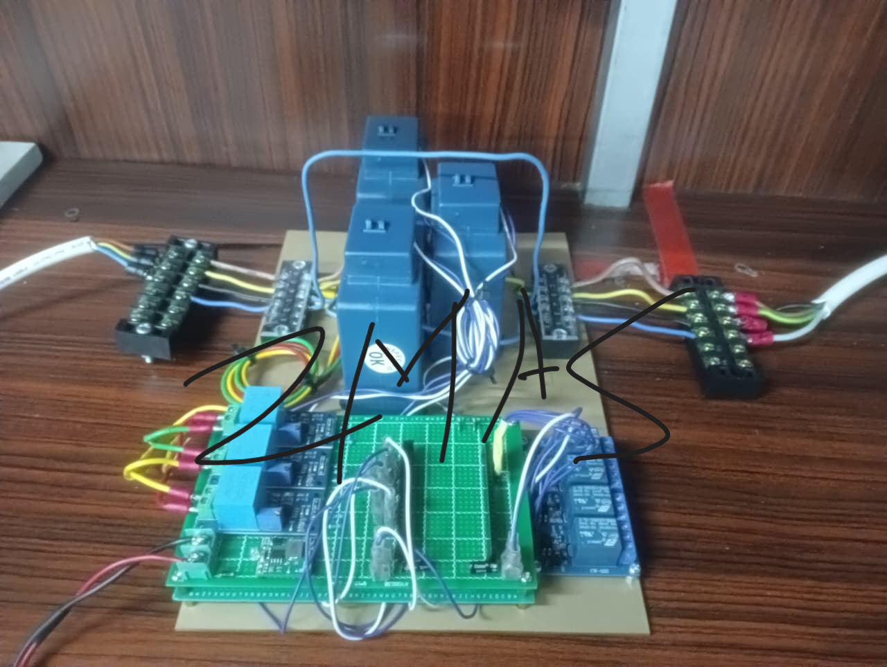
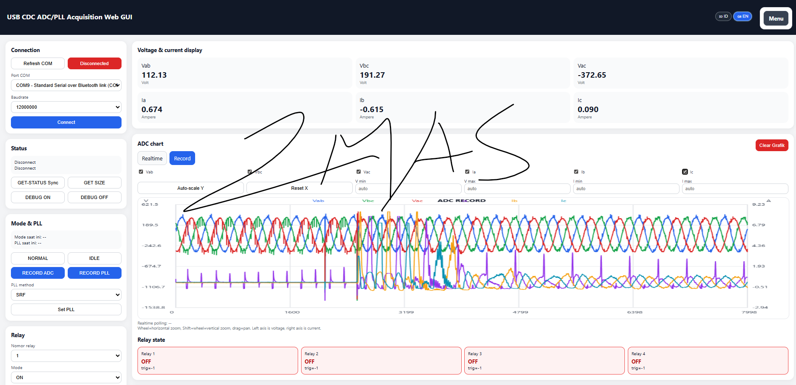

# Embedded 3-Phase Monitoring System

A real-time embedded monitoring platform for 3-phase electrical systems using STM32H743 microcontroller.

The system is designed for electrical parameter acquisition, signal processing, and industrial monitoring applications.

---

## Features

- 3-phase voltage monitoring
- 3-phase current monitoring
- RMS calculation
- Active and reactive power calculation
- Frequency measurement
- High-speed ADC sampling
- Real-time web monitoring GUI
- Modular firmware architecture
- Expandable communication interface

---

## Hardware Components

### Microcontroller

STM32H743 high-performance ARM Cortex-M7 microcontroller.



---

### Voltage Sensor

Voltage sensing circuit for 3-phase AC measurement.



---

### Current Sensor

Current sensing module using CT/Hall-effect sensor.


---

## System Architecture

The following diagram shows the overall system architecture.



---

## Web Monitoring Interface

Real-time monitoring dashboard for displaying electrical parameters.

Features:
- Voltage monitoring
- Current monitoring
- Frequency display
- Live sensor updates



---

## Software Architecture

```text
ADC Sampling
    ↓
Signal Conditioning
    ↓
Communication Layer
    ↓
Web Monitoring GUI
